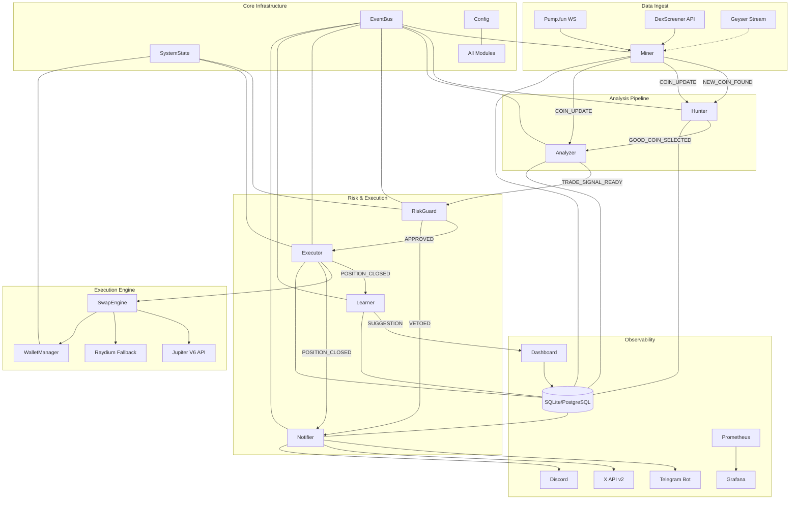
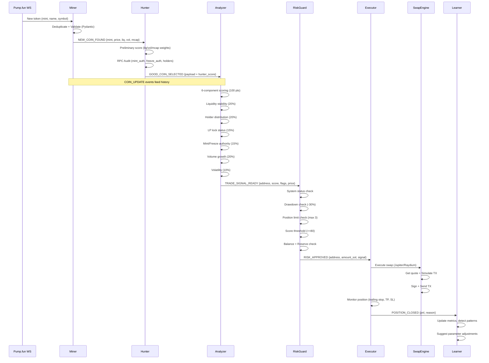

# THE PREDATOR - Architektonick\u00e1 Anal\u00fdza & Roadmap v2.0

**Datum:** 2026-02-16
**Autor:** Senior AI Architect
**Stav:** F\u00e1ze 1 - Kompletn\u00ed anal\u00fdza

---

## 1. MAPA PROJEKTU

### 1.1 Moduly a komponenty

| Modul | Soubor | Stav | Popis |
|-------|--------|------|-------|
| **Core: Config** | `core/config.py` | OK | Pydantic Settings, .env + YAML |
| **Core: Database** | `core/database.py` | BUGGY | SQLite synchronn\u00ed, 8 tabulek |
| **Core: EventBus** | `core/event_bus.py` | BUGGY | Pub/sub, async/sync callbacky |
| **Core: SystemState** | `core/system_state.py` | BUGGY | Glob\u00e1ln\u00ed stav, persistence do DB |
| **Core: Logging** | `core/logging.py` | OK | Du\u00e1ln\u00ed console/file |
| **Miner** | `modules/miner.py` | BUGGY | Pump.fun WS + DexScreener |
| **Hunter** | `modules/hunter.py` | BUGGY | Momentum filtr + RPC audit |
| **Analyzer** | `modules/analyzer.py` | \u010c\u00e1ste\u010dn\u00fd | V\u00e1\u017een\u00e9 sk\u00f3rov\u00e1n\u00ed, LP lock placeholder |
| **RiskGuard** | `modules/risk_guard.py` | BUGGY | Veto br\u00e1na, kill switch |
| **Executor** | `modules/executor.py` | Simulace | Pouze shadow, \u017e\u00e1dn\u00fd Jupiter |
| **Learner** | `modules/learner.py` | Z\u00e1kladn\u00ed | Feedback loop, bez persistence |
| **Notifier** | `modules/notifier.py` | BUGGY | Telegram + X (broken X auth) |
| **WalletManager** | `modules/wallet_manager.py` | Skeleton | Broken sign_transaction |
| **Dashboard** | `scripts/dashboard.py` | UI only | Streamlit, glassmorphism |
| **Main** | `main.py` | BUGGY | Orchestrace, command watcher |

### 1.2 Tech Stack (aktu\u00e1ln\u00ed)

- **Jazyk:** Python 3.10+
- **Async:** asyncio (nativn\u00ed)
- **HTTP:** httpx (async)
- **WS:** websockets
- **DB:** sqlite3 (synchronn\u00ed - probl\u00e9m!)
- **Blockchain:** solana-py, solders
- **Config:** pydantic-settings, python-dotenv, PyYAML
- **UI:** Streamlit
- **Testy:** pytest, pytest-asyncio

---

## 2. IDENTIFIKOVAN\u00c9 D\u00cdRY, CHYBY A NEKONZISTENCE

### 2.1 KRITICK\u00c9 BUGY (blocker\u016f pro produkci)

| # | Soubor | \u0158\u00e1dek | Probl\u00e9m | Z\u00e1va\u017enost |
|---|--------|-------|---------|-----------|
| B1 | `miner.py` | 251 | `_rotate_rpc()` pou\u017e\u00edv\u00e1 `self.current_rpc_idx` a `self.rpc_endpoints` kter\u00e9 NEJSOU definov\u00e1ny v `__init__`. Crash p\u0159i vol\u00e1n\u00ed. | CRITICAL |
| B2 | `hunter.py` | 87-88 + `main.py:39` | Hunter se subscribuje na `NEW_COIN_FOUND` dvakr\u00e1t - jednou v `main.py` a jednou v `hunter.start()`. Ka\u017ed\u00fd event se zpracuje 2x. | CRITICAL |
| B3 | `hunter.py` | 221 | `get_token_largest_accounts` vrac\u00ed max 20 \u00fa\u010dt\u016f, ale `min_holders` threshold je 50. \u017d\u00e1dn\u00fd token nep\u0159ejde. | CRITICAL |
| B4 | `executor.py` | 56-59 | Entry price se \u010dte z `detailed_scores["price"]` co\u017e neexistuje. Fallback `1.0` zni\u010d\u00ed v\u0161echny PnL v\u00fdpo\u010dty. | CRITICAL |
| B5 | `system_state.py` | 51 | Nov\u00fd stav m\u00e1 `balance_sol=0.0`. V SHADOW m\u00f3du nen\u00ed zp\u016fsob jak nastavit virtu\u00e1ln\u00ed balanc. RiskGuard v\u017edy zamitne. | CRITICAL |
| B6 | `wallet_manager.py` | 154 | `transaction.sign(self.keypair)` - `solders.Transaction` nem\u00e1 tento API. Spr\u00e1vn\u011b: `Transaction.sign([keypair], blockhash)`. | CRITICAL |
| B7 | `notifier.py` | 180-187 | X API v2 POST /tweets vy\u017eaduje OAuth 2.0 PKCE nebo OAuth 1.0a user-context. Bearer token funguje JEN pro app-only (read). POST vr\u00e1t\u00ed 403. | CRITICAL |
| B8 | `Dockerfile` | 12 | `CMD ["python", "scripts/main.py"]` - spr\u00e1vn\u011b `main.py` (v rootu). | HIGH |

### 2.2 LOGICK\u00c9 CHYBY A NEKONZISTENCE

| # | Probl\u00e9m | Detail |
|---|---------|--------|
| L1 | **Data se ztr\u00e1c\u00ed v pipeline** | Miner em\u00edt\u00e1 `price`, ale tato hodnota se NEZACHOV\u00c1 p\u0159es Hunter \u2192 Analyzer \u2192 RiskGuard \u2192 Executor. TradeSignal neobsahuje aktu\u00e1ln\u00ed cenu tokenu. |
| L2 | **Spec vs. k\u00f3d: min score** | Spec \u0159\u00edk\u00e1 `min_score=85`, k\u00f3d pou\u017e\u00edv\u00e1 `80`. |
| L3 | **Analyzer LP lock = hardcoded 100** | "P\u0159edpokl\u00e1d\u00e1me sp\u00e1len\u00e9 LP" - poru\u0161uje princip v\u00edcevrstv\u00e9ho auditu. |
| L4 | **daily_pnl kumulace** | Executor p\u0159i\u010d\u00edt\u00e1 `profit_pct` (procentu\u00e1ln\u00ed) k `daily_pnl`, ale pou\u017e\u00edv\u00e1 to jako absolutn\u00ed procento drawdownu. S 3 pozicemi po -15% = -45% co\u017e nen\u00ed re\u00e1ln\u00fd drawdown portfolia. |
| L5 | **Trade DB = INSERT not UPDATE** | Ka\u017ed\u00fd exit vlo\u017e\u00ed nov\u00fd \u0159\u00e1dek (CLOSED), ale p\u016fvodn\u00ed OPEN z\u00e1znam z\u016fst\u00e1v\u00e1. \u017d\u00e1dn\u00e9 propojen\u00ed. |
| L6 | **Notifier vytv\u00e1\u0159\u00ed vlastn\u00ed DB instanci** | `DB: database.Database = database.Database()` m\u00edsto singletonu `db`. Potenci\u00e1ln\u00ed lock konflikty. |
| L7 | **RiskGuard._veto je sync** | Vytv\u00e1\u0159\u00ed `asyncio.create_task()` pro emit, ale vrac\u00ed `False` d\u0159\u00edv ne\u017e event doraz\u00ed. Race condition. |

### 2.3 MEMORY LEAKY A PERFORMANCE

| # | Probl\u00e9m | Detail |
|---|---------|--------|
| M1 | **Miner.dedup_set neomezen\u00fd** | Rostou\u010d\u00ed mno\u017eina bez TTL. P\u0159i 1000+ tokenech/den = memory leak. |
| M2 | **EventBus bez deduplikace subscriber\u016f** | Opakovan\u00fd `subscribe()` (nap\u0159. restart modulu) p\u0159id\u00e1 callback v\u00edcekr\u00e1t. |
| M3 | **DB je synchronn\u00ed** | `sqlite3` v async kontextu blokuje event loop. Spec zmi\u0148uje `aiosqlite` ale nen\u00ed pou\u017eito. |
| M4 | **Hunter._heartbeat: while True** | Nem\u00e1 `self.is_running` check - nikdy se nezastav\u00ed. |
| M5 | **\u017d\u00e1dn\u00fd backpressure v EventBus** | Events se hromad\u00ed bez limitu. |

### 2.4 BEZPE\u010cNOSTN\u00cd PROBL\u00c9MY

| # | Probl\u00e9m | Detail |
|---|---------|--------|
| S1 | **requirements.txt: asyncio==3.4.3** | Asyncio je stdlib, tenhle bal\u00edk je abandonware a m\u016f\u017ee zp\u016fsobit konflikty. |
| S2 | **\u017d\u00e1dn\u00fd .env.example** | V\u00fdvoj\u00e1\u0159i nev\u011bd\u00ed jak\u00e9 ENV vars jsou pot\u0159eba. |
| S3 | **Chyb\u00ed signal handling** | `import signal` v main.py ale nikdy nepou\u017eito. No graceful SIGTERM. |
| S4 | **\u017d\u00e1dn\u00fd health check endpoint** | Docker/K8s nem\u00e1 jak monitorovat \u017eivost. |
| S5 | **X API token v ENV** | Pot\u0159ebuje OAuth 1.0a (4 tokeny), ne jen Bearer. |

### 2.5 CHYB\u011aJ\u00cdC\u00cd FUNKCE (specifikovan\u00e9 ale neimplementovan\u00e9)

| Feature | Stav | Specifikace |
|---------|------|-------------|
| Jupiter V6 swap integrace | CHYB\u00cd | Spec 3.6: SwapEngine |
| Moon bag strategie (80/20) | ZJEDNODU\u0160ENO | Spec: sell 80% at 2x, hold 20% |
| Smart DCA | CHYB\u00cd | Spec 3.6: DCA logic |
| Slippage kontrola | CHYB\u00cd | Spec 3.5: max 1-5% |
| Cooldown mezi obchody | CHYB\u00cd | Spec 3.5: cooldown |
| Raydium fallback | CHYB\u00cd | Spec 1.2: fallback DEX |
| Priority fees | CHYB\u00cd | Spec: priority fee for sniping |
| TX simulace p\u0159ed odesl\u00e1n\u00edm | CHYB\u00cd | Spec: simulateTransaction |
| ML predikce | PLACEHOLDER | Spec 3.3: AI sentiment |
| Health checks | CHYB\u00cd | Spec 8: observability |
| Geyser streaming | CHYB\u00cd | Spec: sub-second updates |
| Virtu\u00e1ln\u00ed balanc pro SHADOW | CHYB\u00cd | Nutn\u00e9 pro testov\u00e1n\u00ed |
| Signal queue (BullMQ/Redis) | CHYB\u00cd | Pro produk\u010dn\u00ed scale |
| CI/CD pipeline | CHYB\u00cd | GitHub Actions |
| Monitoring (Prometheus/Grafana) | CHYB\u00cd | Observability |

---

## 3. ARCHITEKTURA - C\u00cdLOV\u00dd STAV

### 3.1 High-Level Diagram



### 3.2 Data Flow - Token Lifecycle



### 3.3 Tech Stack - C\u00edlov\u00fd

| Vrstva | Technologie | D\u016fvod |
|--------|-------------|--------|
| **Runtime** | Python 3.10+ | Kompatibilita se solana-py |
| **Async** | asyncio + aiosqlite | Non-blocking I/O |
| **HTTP** | httpx (async) | Modern\u00ed, type-safe |
| **WS** | websockets | Pump.fun realtime |
| **DB** | SQLite (aiosqlite) \u2192 PostgreSQL (prod) | Async, WAL mode |
| **Queue** | asyncio.Queue (intern\u00ed) \u2192 Redis/BullMQ (prod) | Backpressure |
| **Blockchain** | solana-py, solders | RPC + signing |
| **DEX** | Jupiter V6 API | Primary swap |
| **Config** | pydantic-settings + YAML | Validace |
| **Monitoring** | structlog + Prometheus | Observability |
| **UI** | Streamlit | Dashboard |
| **CI/CD** | GitHub Actions | Automatizace |
| **Deploy** | Docker + Docker Compose | Kontejnerizace |

---

## 4. ROADMAP IMPLEMENTACE

### F\u00e1ze 0: Hotovo (z\u00e1kladn\u00ed infra)
- [x] EventBus, SystemState, Config, Logging, Database
- [x] Z\u00e1kladn\u00ed struktury modul\u016f

### F\u00e1ze 1: KRITICK\u00c9 OPRAVY BUG\u016e (TATO F\u00c1ZE)
Mus\u00ed b\u00fdt opraveno ne\u017e se cokoliv dal\u0161\u00edho stav\u00ed:

1. **Miner: p\u0159idat chyb\u011bj\u00edc\u00ed RPC atributy** (`current_rpc_idx`, `rpc_endpoints`)
2. **Hunter: odstranit duplicitn\u00ed subscribe** (bu\u010f v main.py NEBO v start())
3. **Hunter: opravit holder_count logiku** (pou\u017e\u00edt `getTokenSupply` + `getProgramAccounts` nebo sn\u00ed\u017eit threshold)
4. **Executor: propagovat price data skrz pipeline** (TradeSignal mus\u00ed n\u00e9st `current_price`)
5. **SystemState: virtu\u00e1ln\u00ed balanc pro SHADOW/PAPER** (default 10 SOL)
6. **Notifier: pou\u017e\u00edt singleton `db`** m\u00edsto vlastn\u00ed instance
7. **EventBus: deduplikace subscriber\u016f**
8. **Hunter._heartbeat: p\u0159idat is_running check**
9. **Dockerfile: opravit CMD path**
10. **requirements.txt: odstranit asyncio==3.4.3**

### F\u00e1ze 2: STABILIZACE PIPELINE
1. Async DB (p\u0159echod na aiosqlite pro v\u0161echny operace)
2. RiskGuard._veto p\u0159epsat na async
3. Miner dedup_set s TTL (max 10k z\u00e1znam\u016f, 1h expiry)
4. Opravit daily_pnl v\u00fdpo\u010det (portfolio-based, ne sum of %)
5. Trade DB: UPDATE OPEN z\u00e1znam p\u0159i exitu m\u00edsto INSERT
6. Signal handling (SIGTERM, SIGINT) v main.py
7. .env.example soubor
8. Backpressure v EventBus (bounded queue)

### F\u00e1ze 3: SWAP ENGINE & JUPITER INTEGRACE
1. SwapEngine modul (Jupiter V6 /quote + /swap)
2. TX simulace p\u0159ed odesl\u00e1n\u00edm (simulateTransaction)
3. WalletManager oprava sign_transaction
4. Priority fees pro sniping
5. Slippage kontrola (adaptivn\u00ed dle likvidity)
6. Raydium fallback router

### F\u00e1ze 4: NOTIFIER & SIGN\u00c1LY (LIVE)
1. X API v2 s OAuth 1.0a (4-token auth)
2. Telegram roz\u0161\u00ed\u0159en\u00ed (formattov\u00e1n\u00ed, fotky, channel support)
3. Discord webhook integrace
4. Message templating system
5. Rate limiting na notifikace

### F\u00e1ze 5: MOON BAG & POKRO\u010cIL\u00c9 STRATEGIE
1. Pln\u00e1 Moon Bag implementace (80/20 split)
2. Smart DCA logika
3. Cooldown mezi obchody
4. Analyzeru LP lock skute\u010dn\u00e1 verifikace (Raydium/Orca pool check)
5. Trailing stop vy lep\u0161en\u00ed

### F\u00e1ze 6: MONITORING & OBSERVABILITY
1. Prometheus metriky export
2. Health check endpoint (HTTP)
3. Structured logging (structlog m\u00edsto logging)
4. Alert syst\u00e9m (Telegram/Slack na kritick\u00e9 ud\u00e1losti)
5. Dashboard roz\u0161\u00ed\u0159en\u00ed (live WebSocket feed)

### F\u00e1ze 7: CI/CD & DEPLOYMENT
1. GitHub Actions (lint, test, build, deploy)
2. Docker Compose pro produkci (bot + dashboard + monitoring)
3. Zero-downtime deployment (blue-green)
4. Automatick\u00e9 z\u00e1lohy DB
5. Secrets management (.env \u2192 secrets manager)

### F\u00e1ze 8: ML & ADVANCED
1. Learner persistence (DB-backed metrics)
2. Jednoduch\u00fd ML model pro score prediction
3. Sentiment anal\u00fdza z X
4. Multi-wallet support
5. Cross-DEX arbitr\u00e1\u017e

---

## 5. PRIORITIZACE

```
OKAM\u017dIT\u011a (F\u00e1ze 1):  Opravy kritick\u00fdch bug\u016f - bez t\u011bchto NIC nefunguje
D\u00c1LE (F\u00e1ze 2-3):    Stabiln\u00ed pipeline + re\u00e1ln\u00e9 swapy
LIVE (F\u00e1ze 4-5):    Notifikace + pokro\u010dil\u00e9 strategie
SCALE (F\u00e1ze 6-7):   Monitoring + deployment
FUTURE (F\u00e1ze 8):     ML + multi-wallet
```

---

*Tento dokument slou\u017e\u00ed jako single source of truth pro architektonick\u00e1 rozhodnut\u00ed.*
